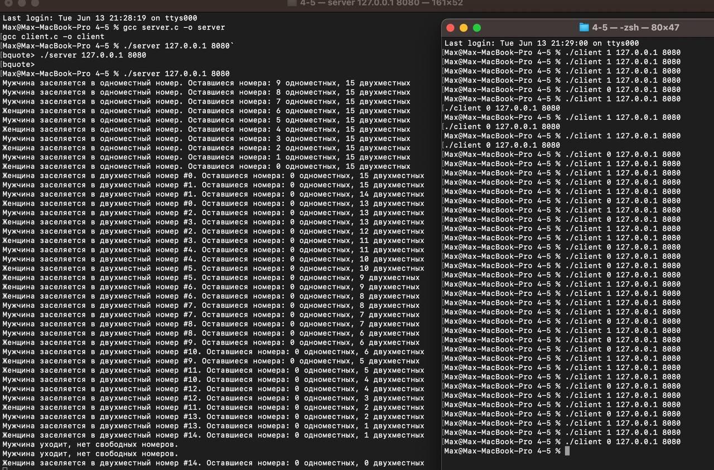
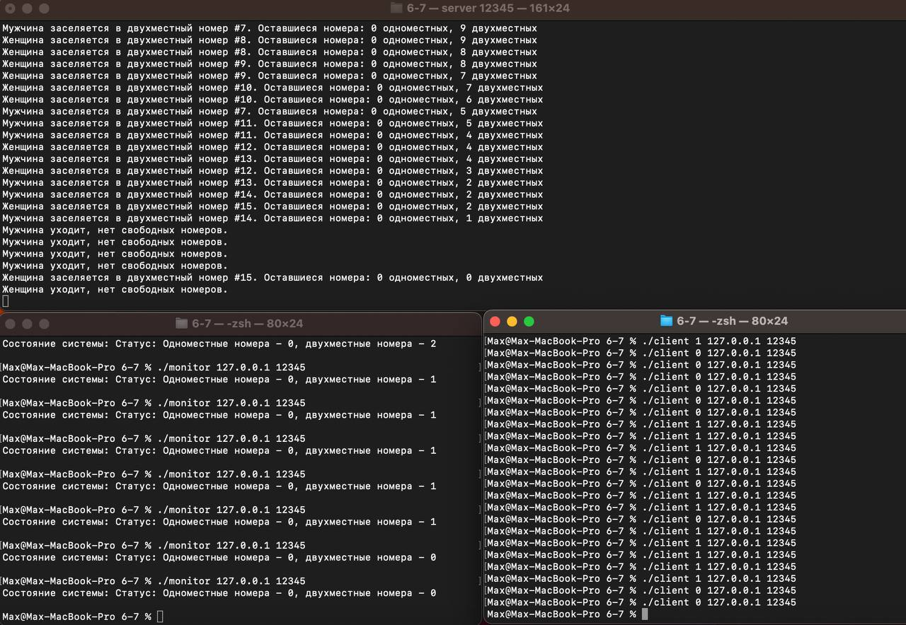
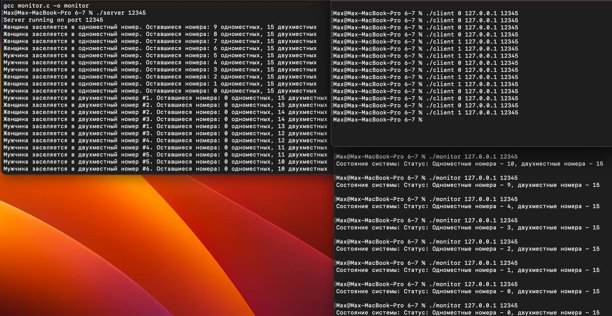

## Домашнее задание №4.

Применение семафоров для организации взаимодействия параллельных процессов.

### **Балабанов Максим Михайлович - БПИ-212**.

### **Вариант №14. <br>**

#### Задача о гостинице – 3 (дамы и джентльмены).

В гостинице 10 номеров рассчитаны на одного человека и 15 номеров рассчитаны на двух человек. В гостиницу случайно
приходят клиенты–дамы и клиенты–джентльмены, и конечно они могут провести ночь в номере только с представителем своего
пола. Если для клиента не находится подходящего номера, он уходит искать ночлег в другое место. Клиенты порождаются
динамически и уничтожаются при освобождении номера или уходе из гостиницы при невозможности поселиться. Создать
приложение, моделирующее работу гостиницы. Каждого клиента реализовать в виде отдельного процесса.


## 4-5 баллов

Программа представляет собой простую модель отеля, включающую серверную часть, клиентскую часть и монитор. Сервер обрабатывает запросы от клиентов, которые могут заселяться в одноместные или двухместные номера. Клиентская часть предназначена для отправки запросов на заселение в отель, а монитор позволяет получать информацию о состоянии системы.

В целом, программа позволяет клиентам заселяться в отель и отображает информацию о состоянии системы. При запуске клиента указывается пол посетителя (0 - женщина, 1 - мужчина), IP-адрес и порт сервера. Каждый клиент отправляет запрос на заселение в отель, а сервер обрабатывает эти запросы, отображая информацию о состоянии отеля. Монитор позволяет получать текущее состояние системы, показывая количество доступных одноместных и двухместных номеров.

Результат работы программы зависит от порядка запуска клиентов и от обработки запросов сервером. Когда клиент отправляет запрос на заселение в отель, сервер отображает соответствующую информацию о состоянии отеля. Клиент получает ответ от сервера и завершает свою работу. Монитор также может быть запущен для получения текущего состояния системы.

Для компиляции используйте gcc:
```
gcc server.c -o server
gcc client.c -o client
```

Запустите сервер:

```./server 127.0.0.1 8080```

Запустите клиентскую программу, указывая пол посетителя (0 или 1):

```
./client 1 127.0.0.1 8080
./client 0 127.0.0.1 8080
```



## 6-7 баллов

Программа представляет собой моделирование работы отеля с использованием клиентской программы, серверной программы и монитора. Клиентская программа позволяет отправлять запросы на заселение в отель, серверная программа обрабатывает эти запросы и отображает информацию о состоянии отеля, а монитор предоставляет возможность получать комплексную информацию о выполнении приложения в целом.

Изменения в коде клиента:

Функция request_room осталась без изменений. Она создает UDP-сокет клиента, инициализирует структуру sockaddr_in с информацией о сервере и отправляет запрос на заселение в отель.
Изменения в коде монитора:

Добавлена функция request_status, которая отправляет запрос на получение состояния системы серверу. Она создает UDP-сокет клиента, инициализирует структуру sockaddr_in с информацией о сервере и отправляет запрос "status" на сервер. Затем она принимает ответ от сервера и выводит его на экран.
Изменения в коде сервера:

Функция handle_client теперь обрабатывает запросы от клиентов. Она принимает сокет клиента, структуру sockaddr_in с информацией о клиенте и размер структуры адреса. В зависимости от полученного запроса, она либо отправляет информацию о состоянии отеля клиенту, либо обрабатывает запрос на заселение клиента в отель и выводит соответствующую информацию на экран.
В функции main изменен порядок создания и привязки серверного сокета. Сначала создается сокет с помощью функции socket, а затем структура sockaddr_in с информацией о сервере и порту инициализируется для привязки сокета к адресу. Затем происходит инициализация состояния отеля с помощью функции init_hotel, и сервер ожидает запросы от клиентов и обрабатывает их с помощью функции handle_client.
Программа позволяет клиентам заселяться в отель и получать информацию о состоянии системы. При запуске клиента указывается пол посетителя (0 - женщина, 1 - мужчина), IP-адрес и порт сервера. Каждый клиент отправляет запрос на заселение в отель, а сервер обрабатывает эти запросы, обновляет состояние отеля и выводит информацию о нем. Монитор также может быть запущен для получения комплексной информации о выполнении приложения в целом, позволяя обойтись без использования отдельных видов, предоставляемых клиентами и серверами по отдельности.



## 8 баллов

Этот проект представляет собой приложение, которое позволяет подключать множество клиентов и осуществлять наблюдение за состоянием работы сервера с многих независимых компьютеров. Клиенты могут запросить заселение в отель, а также запросить информацию о состоянии отеля. Кроме того, клиенты-наблюдатели могут отключаться и подключаться динамически без нарушения работы всего приложения.

Серверная часть программы представляет собой симуляцию отеля с одноместными и двухместными номерами. Сервер создает сокет и привязывает его к определенному порту. Затем сервер ожидает подключения клиентов и создает отдельный поток для обработки каждого подключения. В потоке обрабатывается запрос клиента, выполняется заселение в номер и обновляется информация об отеле.

Клиентская часть программы позволяет посетителям отеля подключаться к серверу и отправлять запросы о заселении и запросы на получение информации о состоянии отеля. После отправки запроса о заселении, клиент ожидает ответ от сервера и выводит соответствующее сообщение. После отправки запроса на получение информации, клиент также ожидает ответ и выводит информацию о состоянии отеля.

Монитор является дополнительным компонентом программы, который позволяет наблюдать состояние отеля с многих независимых компьютеров. Монитор подключается к серверу и отправляет запрос на получение информации о состоянии отеля. Затем он ожидает ответ от сервера и выводит полученную информацию.


Для компиляции используйте gcc:

```
gcc server.c -o server -lpthread
gcc client.c -o client
gcc monitor.c -o monitor
```

Таким образом, программа позволяет подключать множество клиентов и осуществлять наблюдение за работой сервера с многих независимых компьютеров. Клиенты-наблюдатели могут отключаться и подключаться динамически, а сервер корректно обрабатывает все подключения и запросы от клиентов.



## 9-10 баллов
Этот проект включает в себя две основные части: сервер и клиент, а также модуль мониторинга.

Серверная часть представляет собой симуляцию отеля с одноместными и двухместными номерами. Для каждого двухместного номера сохраняется количество заселенных людей и их пол. Сервер обрабатывает два типа запросов от клиентов: заселение посетителей и запрос на статус отеля.

Клиент может отправить информацию о поле посетителя, в ответ на которую сервер заселяет посетителя в соответствующий номер и обновляет информацию об отеле. Если нет свободных номеров, клиенту отказывают в заселении. Клиент также может запрашивать текущий статус отеля, получая информацию о доступных номерах.

Сервер создает сокет типа SOCK_DGRAM, к которому могут подключаться клиенты и мониторы. Сервер обрабатывает входящие запросы от клиентов и мониторов в бесконечном цикле.

Клиентская часть подключается к серверу через сокет и передает информацию о поле посетителя или запрашивает статус отеля. Клиент завершает работу после получения ответа от сервера.

Монитор - это отдельная программа, которая может запрашивать статус отеля от сервера. Подобно клиенту, монитор подключается к серверу через сокет, отправляет запрос на статус отеля, а затем выводит полученную информацию.

При запуске клиентского приложения передается аргумент, определяющий пол посетителя (0 или 1) или слово "status" для запроса статуса отеля. Это значение передается серверу при подключении.

Все эти приложения написаны на языке C и используют сокеты для общения между процессами.

Для компиляции используйте gcc:

```
gcc server.c -o server
gcc client.c -o client
gcc monitor.c -o monitor
```

Запустите сервер:
```
./server <port>
```

Запустите клиентскую программу, указывая пол посетителя (0 или 1) или "status" для запроса статуса:
```
./client <server_ip> <port> <gender_or_status>
```

Запустите монитор, указывая "status" для запроса статуса:
```
./monitor <server_ip> <port> status
```

Запустите столько клиентов и мониторов, сколько хотите заселить в отель или запросить информацию о статусе. Каждый клиент и монитор подключается к серверу, выполняет свою задачу и завершает работу. Сервер продолжает работать, пока не будет остановлен.

Вы можете запустить несколько клиентов, чтобы заселить их в отель. Каждый клиент будет отправлять периодические запросы на сервер, чтобы проверить его доступность. Если сервер перестанет отвечать на запросы клиентов, клиенты заключат, что сервер недоступен, и завершат работу. При этом монитор будет отображать текущее состояние отеля, включая количество свободных одноместных и двухместных номеров.

# OS_4
